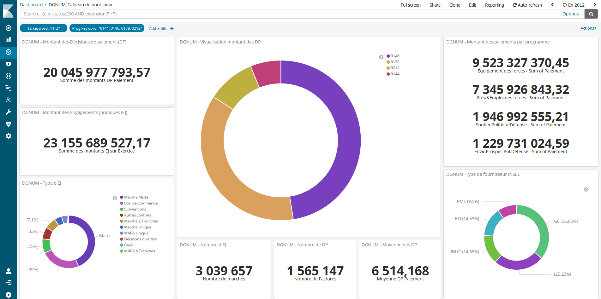
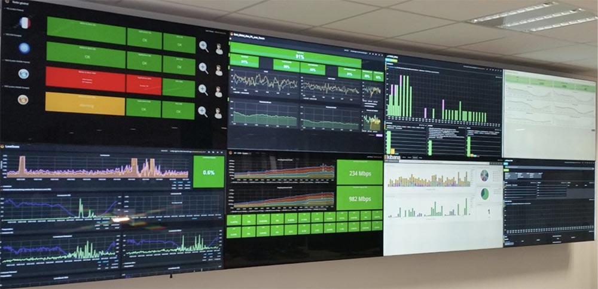

== Kibana

=== !

[.notes]
--
* Ministère des Armées
* source : https://www.elastic.co/fr/customers/ministry-of-armed-services-france
* DataFIN 360 : fonction financière
* 10,000 utilisateurs en 2020
* 5 milliards d'événements
--

=== !

[.notes]
--
* SNCF
* Écrans muraux, mix entre Kibana et Grafana
* source : https://www.elastic.co/fr/customers/oui-sncf
--

=== Autres fonctionnalités

[.step]
* Index patterns
* Politique de cycle de vie des index
* DevTools

