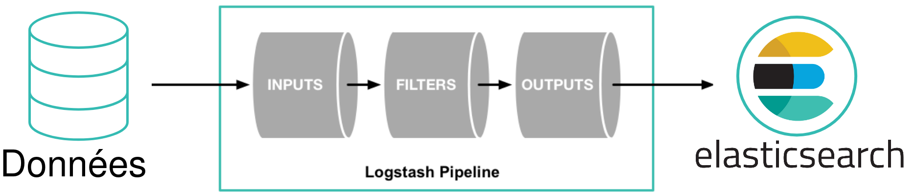
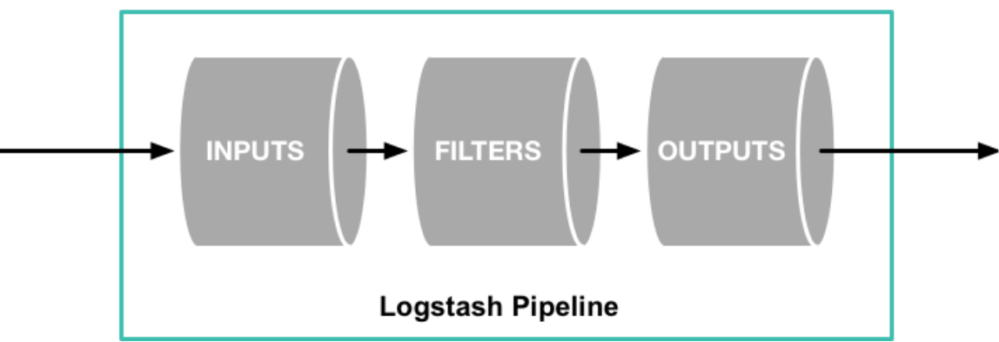

== Logstash

=== !

=== Inputs

[.step]
* Fichier
* JDBC
* Kafka
* HTTP
* Beats
* S3
* 51 autres plugins ...

=== kafka

[source, json]
----
input {
	kafka {
            bootstrap_servers => "${BOOTSTRAP_SERVERS}"
            group_id => "${GROUP_ID}"
            enable_auto_commit => "${AUTO_COMMIT:true}"
            topics => ["${TOPIC_ONEPOINT}"]
        }
}
----

=== file

[source, json]
----
input {
	file {
		path => ["${REPERTOIRE}/onepoint.bordeaux*.csv"]
		start_position => "beginning"
		mode => "read"
		ignore_older => "2 days"
		add_field => {
            		"agence" => "bordeaux"
                }
	}
}
----

=== jdbc

[source, json, highlight=1..17|3..4|5..7|8..11|12|13..15]
----
input {
	jdbc {
		jdbc_driver_library => "${JDBC_DRIVER_LIBRARY}"
		jdbc_driver_class => "org.postgresql.Driver"
		jdbc_connection_string => "${JDBC_CONNECTION}"
		jdbc_user => "${JDBC_USER}"
		jdbc_password => "${JDBC_PASSWORD}"
		statement => "SELECT * FROM onepoint
			WHERE date_creation > :sql_last_value
			ORDER BY date_creation
			limit ${JDBC_LIMIT:10000}"
		schedule => "${JDBC_SCHEDULE:* * * * *}"
		last_run_metadata_path => "${DATA_PATH}/logstash_jdbc_last_run.txt"
		tracking_column => "date_creation"
		tracking_column_type => "timestamp"
	}
}
----

=== Filters

[.step]
* Ajouter des champs
* Modifier le contenu des champs
* Convertir des champs
* Supprimer des champs
* 49 plugins disponibles

=== mutate

[source, json, highlight=1..10|3|4|8]
----
filter {
    mutate {
        lowercase => [ "fieldname" ]
        add_field => { "shortHostname" => "%{[hostname][0]}" }
    }

    mutate {
        rename => {"shortHostname" => "hostname"}
    }
}
----

=== grok

[source]
----
2024-02-14T14:46:42.000+00:00 INFO [OnepointApp.com.Transaction.Manager]:Starting transaction for session XXXXX
----

[source, json]
----
filter {
    grok {
        match => { "message" => "%{TIMESTAMP_ISO8601:timestamp} %{LOGLEVEL:log-level} \[%{DATA:class}\]:%{GREEDYDATA:message}" }
    }
}
----

=== Outputs

[.step]
* Elasticsearch
* API Elasticsearch
* Sortie standard en local
* 58 autres ...

[.notes]
--
* Importance des identifiants
* ETL
--

=== !

=== !

[source, json]
----
# This is a comment. You should use comments to describe
# parts of your configuration.
input {
  ...
}

filter {
  ...
}

output {
  ...
}
----

=== pipelines.yml

[source, json, highlight=1..4|1..2|3..4]
----
- pipeline.id: mon-pipeline
  path.config: "pipeline-config/mon-pipeline/logstash-*.conf"
- pipeline.id: mon-second-pipeline
  path.config: "pipeline-config/mon-second-pipeline/logstash-*.conf"
----

=== !

[source, json, highlight=1..11|2|4..8|9..11]
----
- mon_repo_git
   +- pipelines.yml
   +- pipeline-config
   |  +- mon-pipeline
   |     +- logstash-1-input.conf
   |     +- logstash-2-filter.conf
   |     +- logstash-2-filter-grok.conf
   |     +- logstash-3-output.conf
   |  +- mon-second-pipeline
   |     +- logstash-1-input.conf
   |     +- logstash-3-output.conf
----

