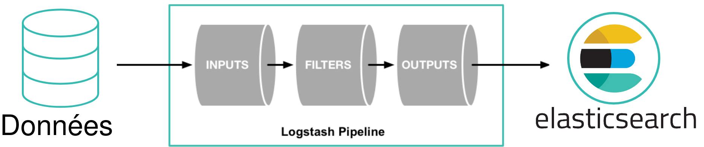
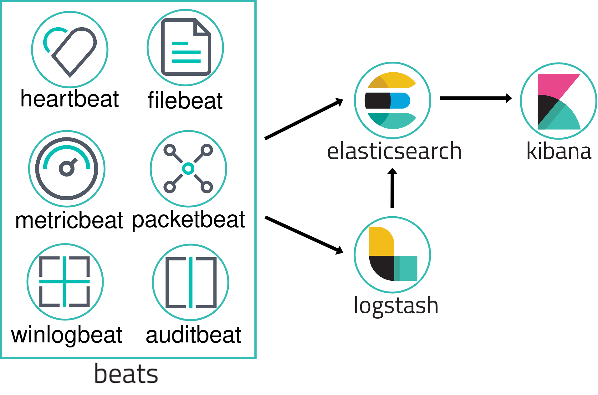

== Outils

=== !

[.notes]
--
* Limité par les performances de Compass, Shay Banon créé Elasticsearch en 2010
* Indexation et recherche de données
* Basé sur Apache Lucene
* Distribué (indices > shards > replicas)
* Tout type de données : texte, numérique, géospatiale, structurée, non structurée
* API REST
* Orienté document
* Chaque type de données est stocké sous une forme spécifique pour optimiser les performances de recherche
--

=== Document

[.step]
* Une unité de stockage
* JSON
* Stocké dans un index
* Chaque document possède un identifiant unique
* Deux métadonnées : `_index` et `_id`
* Ensemble de clés/valeurs appelées champs

[.notes]
--
* Possibilité d'associer un schéma ou non
* Schéma spécifique pour utiliser des formats de date personnalisé par exemple
--

=== !

=== !

=== !

=== !

=== !

=== !

